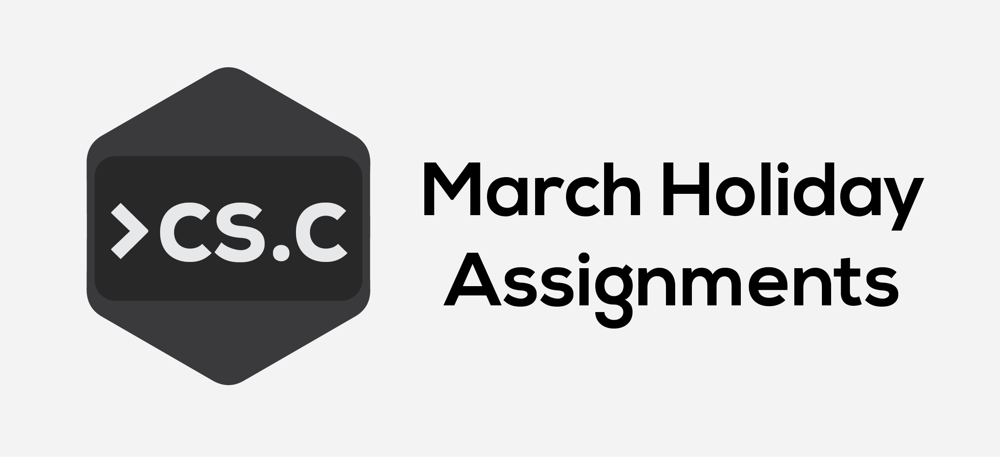

# CSC 2018 March Assignments

✨ CSC Assignments for March Holidays 2018.

# Getting Started

1. Create a GitHub account
2. Get added to the `csc2018` organisation
3. **Fork** this repository [here](https://github.com/csc2018/march-hols), on the top right of the page

# Using the Fork

1. Get GitHub desktop [here](https://desktop.github.com/)
2. Follow the installation instructions
3. Clone the repository (File > New Repository) with the folder location of your choice
4. Open the folder with your code editor and edit the assignment files
5. You can read the instructions for each assignment on the GitHub repository itself (e.g. [here](https://github.com/csc2018/march-hols/blob/master/assignments/01-introduction/readme.md))

# Submission

1. Tick all changed files ready for upload
2. Add a helpful commit message and optional description
3. **Publish** the new code / **push** new changes

# Updating

1. **Pull** to get the updated version of this repo
2. Resolve any errors using a code editor

# For CLI users

```bash
# Clone the repository
$ git clone https://github.com/YourUsername/march-hols

# Push your changes
$ git add .
$ git commit -m "Initial commit"
$ git push -u origin master

# Pull latest updates (new assignments)
$ git pull
```

# Code Editors
* [Visual Studio Code](https://code.visualstudio.com/)
* [Atom](https://atom.io)
* [Sublime Text](https://www.sublimetext.com/)
* [Notepad++](https://notepad-plus-plus.org/)
* [repl.it](https://repl.it)